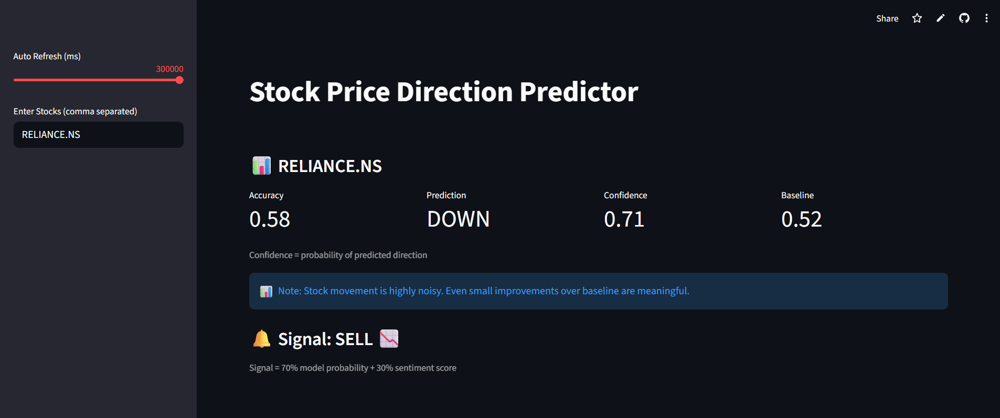
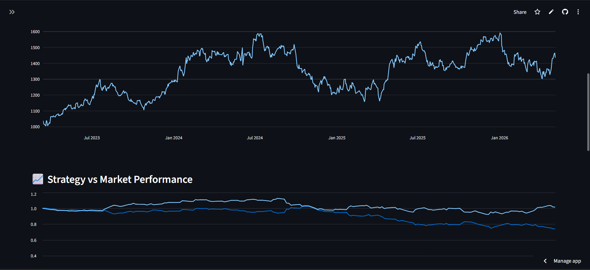

# 📈 Stock Direction Predictor with Sentiment Analysis

An end-to-end Machine Learning system that predicts stock price direction using technical indicators and sentiment analysis, with built-in backtesting to evaluate trading strategies.

---

## 🚀 Live Demo

👉 https://stock-direction-predictor-av6i8ugm2pmgiefvws5ohy.streamlit.app/

---

## 📌 Problem Statement

Stock price movement is highly noisy and difficult to predict.
This project aims to:

* Predict **next-day stock direction**
* Combine **technical indicators + news sentiment**
* Evaluate performance using **backtesting**

---

## ⚙️ Tech Stack

* **Language:** Python
* **ML Model:** XGBoost
* **Libraries:** Pandas, NumPy, Scikit-learn, TA
* **Visualization:** Plotly, Streamlit
* **Data Source:** yFinance
* **NLP:** NLTK (VADER Sentiment Analysis)

---

## 🧠 Approach

### 1. Feature Engineering

* Moving Averages (MA10, MA50)
* RSI (Relative Strength Index)
* MACD (Trend indicator)
* Volatility & Momentum
* Lag-based returns

---

### 2. Model

* XGBoost Classifier
* Handles non-linear relationships
* Robust for tabular financial data

---

### 3. Sentiment Integration

* News scraped from Google News
* Sentiment scored using VADER
* Combined with model prediction (70% ML + 30% sentiment)

---

### 4. Prediction Logic

```python
score = (model_probability * 0.7) + (sentiment_score * 0.3)
```

* Score > 0.6 → BUY 📈
* Score < 0.4 → SELL 📉
* Else → HOLD ⏳

---

## 📊 Results

| Metric            | Value |
| ----------------- | ----- |
| Model Accuracy    | ~60%  |
| Baseline Accuracy | ~55%  |
| Improvement       | +5%   |

> ⚠️ Note: Stock prediction is inherently noisy. Even small improvements over baseline are meaningful.


---

## 📈 Backtesting (Key Highlight)

The model is evaluated using a **long/short trading strategy**:

* UP → Buy (Long)
* DOWN → Sell (Short)

### 📊 Strategy vs Market



### 📊 Backtest Summary

* Strategy Return: 0.8
* Market Return: 0.92

---

## 📊 Feature Importance

The model highlights which indicators influence predictions the most:

* RSI → Momentum signal
* MA50 → Long-term trend
* Volatility → Market uncertainty

(Add screenshot here)

---

## 🖥️ Application Features

* Multi-stock analysis
* Real-time prediction
* Confidence score
* Sentiment-aware signals
* Interactive charts
* Strategy backtesting

---

## 📂 Project Structure

```
app.py        → Streamlit UI
data.py       → Data loading & preprocessing
model.py      → Model training & evaluation
utils.py      → Sentiment & signal logic
```

---

## 🚀 How to Run Locally

```bash
git clone https://github.com/your-repo-link
cd stock-direction-predictor

pip install -r requirements.txt
streamlit run app.py
```

---

## 🧠 Key Learnings

* Stock prediction is close to random → evaluation matters more than accuracy
* Feature engineering is critical in financial ML
* Combining ML with external signals improves robustness
* Backtesting is essential for real-world validation

---

## 📌 Future Improvements

* Hyperparameter tuning
* LSTM / deep learning models
* Portfolio optimization
* Real-time trading integration

---

## 👨‍💻 Author

Pratham Agarwal

* GitHub: https://github.com/1234pratham2k6k1234-glitch
* LinkedIn: https://linkedin.com/in/pratham-agarwal-3931552a4/

---
